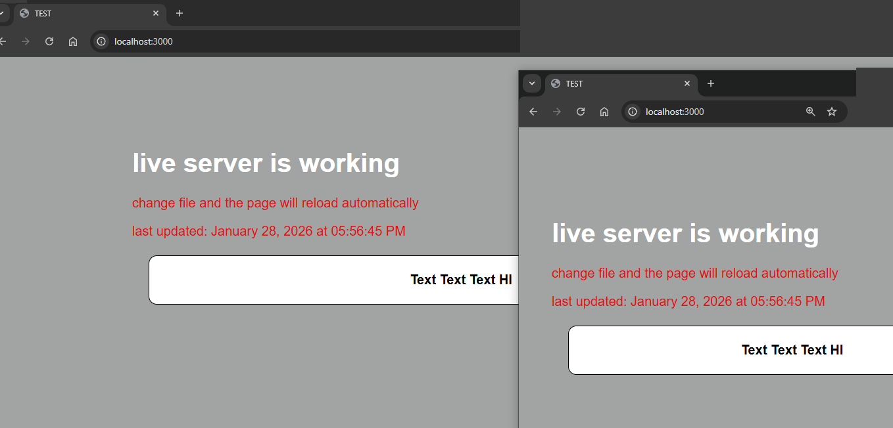
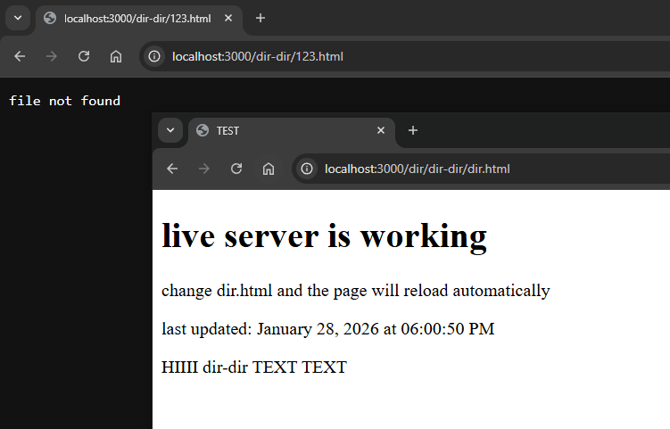

# practice-8. live server

## installation

```bash
npm install
```
## usage

```bash
npm start
```

## how to use

1. start the server
2. open `http://localhost:3000`
3. edit file index.html (maybe styles.css) file or file in dir/dir-dir folder
4. page will reload automatically so you can see changes


